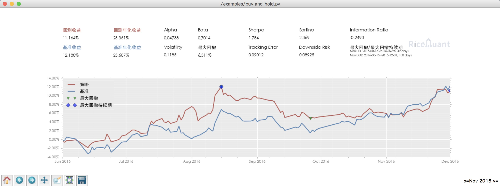

.. _intro-tutorial:

====================
10分钟学会 RQAlpha
====================

在本教程中，我们假设 RQAlpha 已经正确安装在您的系统中，并且已经完成了相应回测数据的同步，如果有任何安装相关的问题，请首先查看 :ref:`intro-install`

我们从 :ref:`intro-examples` 中选取 :ref:`intro-examples-buy-and-hold` 来进行回测。

在进行回测的过程中需要明确以下几个回测要素：

*   数据源路径
*   策略文件路径
*   回测起始时间
*   回测结束时间
*   起始资金
*   Benchmark

假如我们的策略存放在了 `./rqalpha/examples/buy_and_hold.py` 路径下， 数据源存放在 `./rqalpha/bundle/` 路径下，回测的起始时间为 `2016-06-01`, 结束时间为 `2016-12-01`，我们给策略分配的起始资金为 `100000`, Benchmark 设置为 `000300.XSHG`

那么我们通过如下命令来运行回测

::

    rqalpha run -f ./rqalpha/examples/buy_and_hold.py -d ./rqalpha/bundle/ -s 2016-06-01 -e 2016-12-01 --stock-starting-cash 100000 --benchmark 000300.XSHG

如果我们想要以图形的方式查看回测的结果， 则增加 `--plot` 参数

::

    rqalpha run -f ./rqalpha/examples/buy_and_hold.py -d ./rqalpha/bundle/ -s 2016-06-01 -e 2016-12-01 --stock-starting-cash 100000 --benchmark 000300.XSHG --plot

如果想把回测的数据保存下来，可以通过 `-o` 参数将结果保存成 `pkl` 文件。

::

    rqalpha run -f ./rqalpha/examples/buy_and_hold.py -d ./rqalpha/bundle/ -s 2016-06-01 -e 2016-12-01 --stock-starting-cash 100000 --benchmark 000300.XSHG --plot -o result.pkl

等回测结束后可以通过 `pandas.read_pickle` 函数来读取数据进行之后的数据分析。

::

    In [1]: import pandas as pd

    In [2]: df = pd.read_pickle('result.pkl')

    In [3]: df.columns
    Out[3]:
    Index(['alpha', 'annualized_returns', 'benchmark_annualized_returns',
           'benchmark_daily_returns', 'benchmark_total_returns', 'beta', 'cash',
           'daily_pnl', 'daily_returns', 'downside_risk', 'information_ratio',
           'market_value', 'max_drawdown', 'portfolio_value', 'positions',
           'sharpe', 'sortino', 'total_returns', 'tracking_error', 'trades',
           'volatility'],
          dtype='object')

